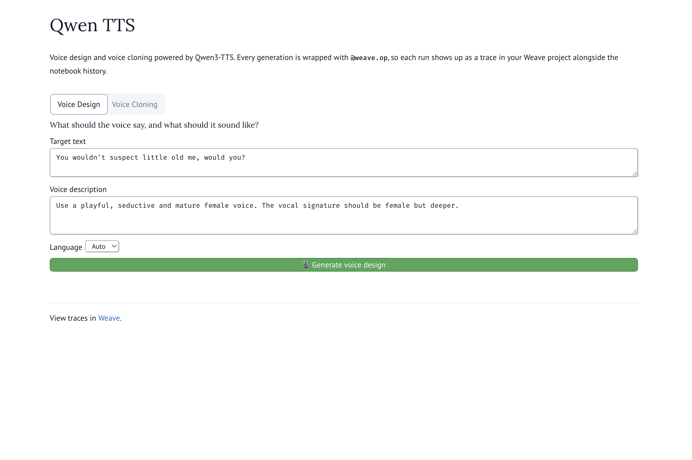
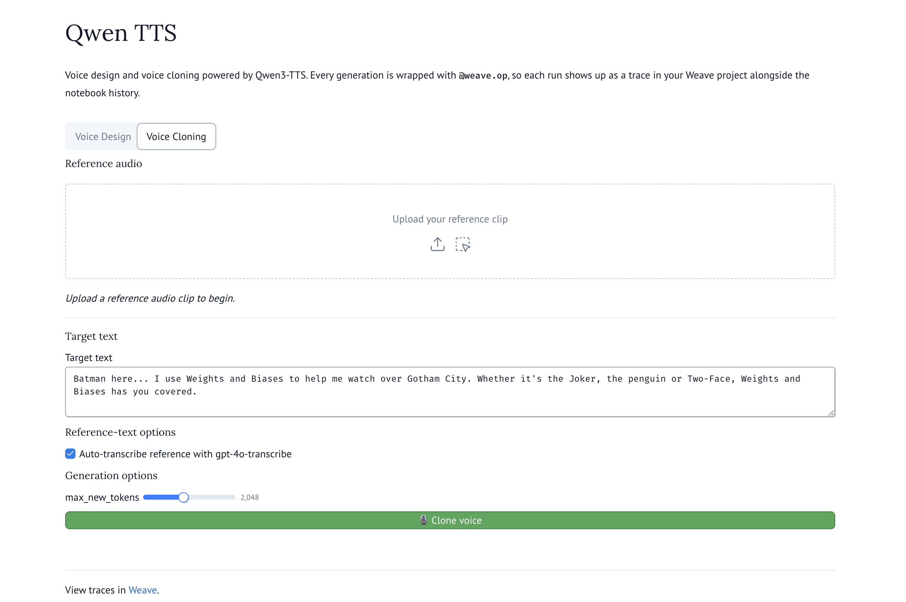

# Weave TTS

Text-to-speech experimentation using Qwen3-TTS models, with optional Weave observability.

## Features

- **Voice Design**: Generate speech with custom voice characteristics from a natural-language description
- **Voice Cloning**: Clone voices from a reference audio clip
- **Marimo UI**: One interactive app that exposes both flows side-by-side
- **Experiment Tracking (optional)**: Every generation is wrapped with `@weave.op`. Enable Weave to log each run as a trace in your Weave project, or run fully private — see the [Weave tracing toggle](#weave-tracing-toggle) section.

## Requirements

- Python >=3.12
- HuggingFace account with access to Qwen3-TTS models
- Weights & Biases account (optional — only needed if you turn Weave tracing on)

## Setup

1. Install dependencies using uv:
```bash
uv sync
```

2. Install the qwen-tts library via pip:
```bash
uv pip install -U qwen-tts
```

3. Copy `.env_example` to `.env` and fill in your values:
```bash
cp .env_example .env
```

### `.env_example` commentary

The template file ships the following keys:

| Key | What it is | When you need it |
|---|---|---|
| `HUGGINGFACEHUB_API_TOKEN` | HuggingFace API token with access to the Qwen3-TTS model artifacts | **Always** — the models are gated on HF |
| `WANDB_API_KEY` | Weights & Biases API key | Only when `WEAVE_ENABLED=true` (i.e. you want traces) |
| `WANDB_ACCOUNT` | Your W&B account/entity name | Only when `WEAVE_ENABLED=true` |
| `WEAVE_PROJECT` | Weave project to log traces into | Only when `WEAVE_ENABLED=true` |
| `WEAVE_ENABLED` | `true` / `false` toggle for Weave tracing in the marimo app | Always present; **defaults to `false`** in `.env_example` so a freshly-cloned setup runs privately |

Reference-audio transcription (used inside voice cloning) runs **locally via HuggingFace Whisper** (`openai/whisper-small`), so no OpenAI API key is required.

## Usage

### Marimo app (recommended)

`app.py` is a thin [marimo](https://marimo.io) notebook that imports the heavy logic (Weave Model classes, helpers, work-cell bodies) from the `weave_tts/` package. Launch it from the repo root:

```bash
# Interactive editor (lets you change cells, inspect state, etc.)
uv run marimo edit app.py

# Read-only "app" view (no cell editing)
uv run marimo run app.py
```

The first generation in each tab triggers a one-time download/load of the corresponding 1.7B Qwen3-TTS model (slow); every subsequent generation in the same session is fast.

#### Weave tracing toggle

`WEAVE_ENABLED` in `.env` controls whether the marimo app logs to Weave:

- `WEAVE_ENABLED=false` — **default in `.env_example`**. The app runs fully private: no `weave.init` call, no trace URLs, no warnings. All `@weave.op` decorators stay in place but log nothing. The footer shows `_Weave tracing disabled — set WEAVE_ENABLED=true in .env to log traces._`
- `WEAVE_ENABLED=true` — needs `WANDB_ACCOUNT` + `WEAVE_PROJECT` set. Every `predict` call logs a trace; the footer shows a link into your Weave project.

You don't need to change any code to flip between modes — just edit `.env` and restart marimo.

#### Voice Design tab

Type the target text and a natural-language voice description, pick a language, and click **Generate voice design**. Output is saved to `audio/designed_audio/generated_audio.wav` and played inline.



#### Voice Cloning tab

Drag a reference audio clip into the upload area, type the target text, and click **Clone voice**. By default the reference clip is transcribed automatically with local Whisper (`openai/whisper-small`); uncheck the box to paste your own transcript instead. Output is saved to `audio/cloned_audio/generated_cloned_audio.wav` and played inline.



### Notebooks

Three Jupyter notebooks demonstrate the same flows interactively. Each one calls `weave.init(...)` unconditionally, so opening any of them requires the `WANDB_ACCOUNT` + `WEAVE_PROJECT` env vars to be set (and `WEAVE_ENABLED` doesn't apply — the notebooks don't read that flag).

- `voice_design_weave.ipynb` — voice design with the `VoiceDesign` head, wrapped in a `VoiceDesignModel(Model)` class.
- `voice_clone_weave.ipynb` — voice cloning with the `Base` head, wrapped in a `VoiceCloneModel(Model)` class.
- `qwen_tts_weave.ipynb` — a **unified** `QwenTTSModel(Model)` class that exposes both tasks as separate `@weave.op` methods (`.design(...)` and `.clone(...)`) sharing one Pydantic config and lazy weight loaders.

Each notebook keeps its own copy of the model class so it stays self-contained; the canonical implementations live in `weave_tts/models.py` and feed the marimo app.

## Models

The project uses two Qwen3-TTS model types:
- **Base (Voice Clone)**: 1.7B parameter model for voice cloning
- **VoiceDesign**: 1.7B parameter model for text-based voice generation

Models are automatically downloaded from HuggingFace on first use.

## Weave Project
Public traces (when generated with tracing on) live here: [wandb-smle/jb_qwen_tts](https://wandb.ai/wandb-smle/jb_qwen_tts/weave/traces).
